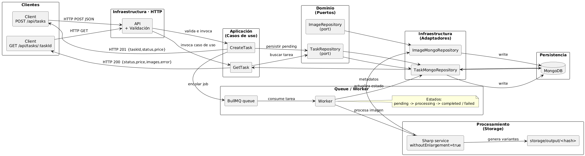

# Image Processing API

## Overview

Image Processing API built with Node.js, TypeScript, Express, MongoDB, Redis (BullMQ) and Sharp. It allows clients to submit image processing tasks and query their status and pricing.

## Requirements

- Node.js >= 18
- npm >= 9
- Docker & Docker Compose (MongoDB, Redis, worker)

## Quick start

1. **Clone the repository** and move into the project directory.
2. **Run the setup script** (installs dependencies, creates storage directories, and starts the Docker stack with API, worker, MongoDB, and Redis):
   ```bash
   bash scripts/setup-local.sh
   ```
3. Verify the services with `docker compose ps` and open `http://localhost:3000/docs` to interact with the API via Swagger.
4. Optionally run:
   ```bash
   node scripts/run-sample-task.mjs
   ```
   to submit a sample task and validate the end-to-end flow.

> The `setup-local.sh` script creates the `storage/input/` and `storage/output/` directories, copies `.env.example` to `.env` (if missing) and starts MongoDB + Redis via Docker.

## Manual setup (alternative)

1. **Install dependencies**
   ```bash
   npm install
   ```

2. **Configure environment variables**
   ```bash
   cp .env.example .env
   ```
   Adjust values as needed and ensure `storage/input/` and `storage/output/` exist.

3. **Start MongoDB and Redis**
   ```bash
   docker compose up -d
   ```

4. **Start API and worker locally** (if you stop Docker services and prefer running processes on your machine):
   ```bash
   npm run start:dev
   ```
   ```bash
   npm run start:worker:dev
   ```

5. **Build & production start** (optional)
   ```bash
   npm run build
   npm run start
   ```

## Testing

- Linting
  ```bash
  npm run lint
  ```

- Tests (unit + integration)
  ```bash
  npm test
  ```

## API

Swagger UI is available at `http://localhost:3000/docs` when the server is running. The OpenAPI spec is generated using annotations in `src/infrastructure/http/routes/task.routes.ts`.

### POST `/api/tasks`
Create a new processing task.

**Request body**
```json
{
  "originalPath": "/input/example.jpg"
}
```

**Response (201)**
```json
{
  "taskId": "66f39b9f5213c4fafa0c1234",
  "status": "pending",
  "price": 23.45
}
```

### GET `/api/tasks/{taskId}`
Retrieve task details.

**Response (200)**
```json
{
  "taskId": "66f39b9f5213c4fafa0c1234",
  "status": "pending",
  "originalPath": "/input/example.jpg",
  "price": 23.45,
  "error": null,
  "images": []
}
```

## Project architecture

- `src/domain/`: Entities, repository/service contracts.
- `src/application/`: Use cases and request/response DTO validation.
- `src/infrastructure/`: Mongo repositories, HTTP layer, Redis/BullMQ connections, workers, and storage services.
- `src/shared/`: Common configuration (`env`), logging, utilities.
- `tests/`: Unit and integration tests (`MongoMemoryServer`, `supertest`).

### Processing flow



- **Request submission**. The client calls `POST /api/tasks`; `CreateTaskUseCase` validates input, assigns a price, persists the task as `pending`, and enqueues it in BullMQ (Redis).
- **Job consumption**. `task.worker.ts` pulls jobs from the queue, marks tasks as `processing`, downloads the original image (local path or URL), and invokes `SharpImageProcessingService`.
- **Image generation**. Sharp resizes the source into 1024px and 800px variants, stores files under `storage/output/<basename>/<resolution>/<hash>.ext`, and `ImageMongoRepository` records metadata in MongoDB.
- **Task status update**. Upon success, `TaskMongoRepository` updates the document to `completed` with variant details; on error, the task is marked `failed` with the error message.
- **Result retrieval**. Clients call `GET /api/tasks/:taskId` to read the latest task state, including price, status, and generated variant paths.

## Seeding

Use the sample data loader to pre-populate MongoDB collections:
```bash
npm run seed
```

This executes `scripts/seed.ts`, which inserts initial tasks and images (see `scripts/mongo-init/sample-data.js`).

## Storage

- Place original images under `storage/input/`.
- Processed variants are written to `storage/output/<basename>/<resolution>/<hash>.<ext>`.
- The `storage/output/` folder stays empty in git (tracked via `.gitkeep`) to avoid committing generated assets.
- `storage/input/example.jpg` is provided for local testing.

## Logging

The API uses `pino` for structured logging. Logs are printed to stdout and include request handling, queue operations and worker events.
